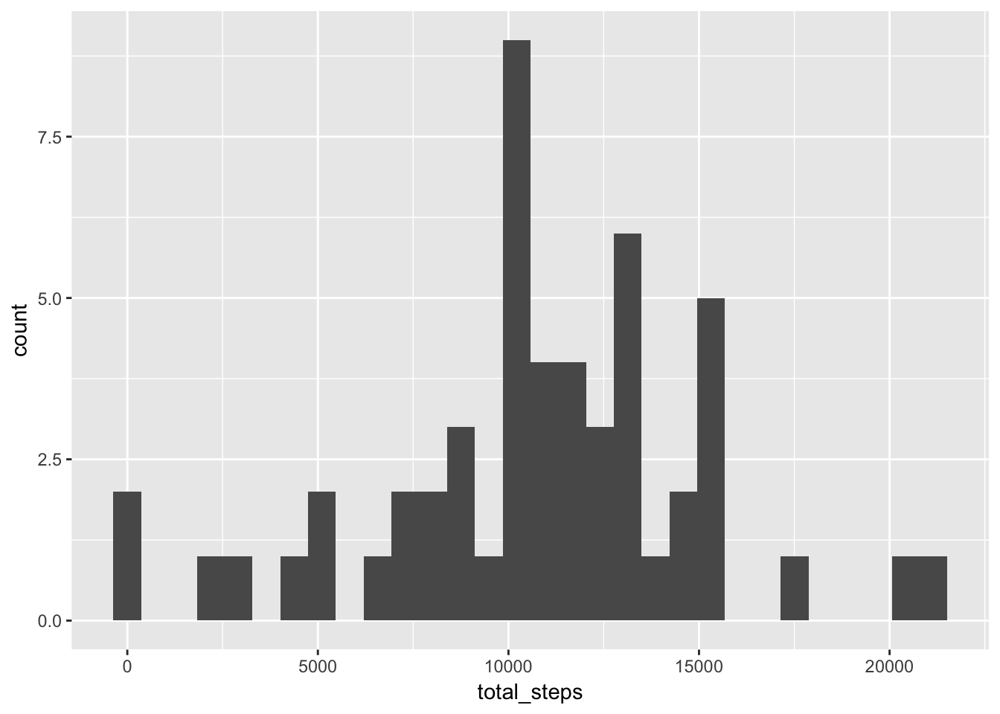
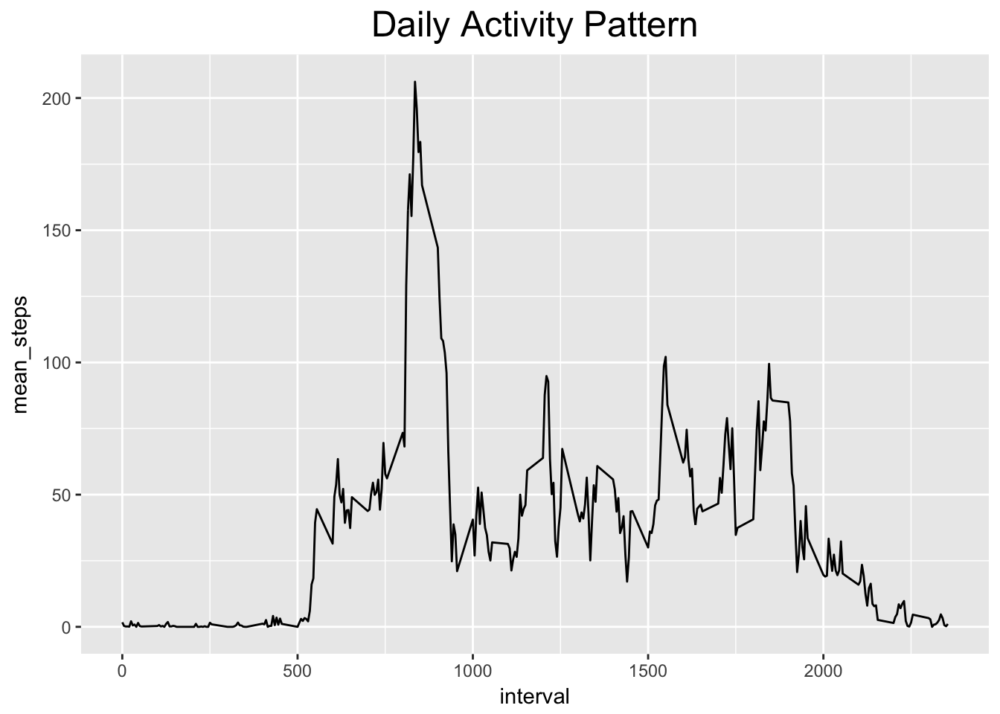
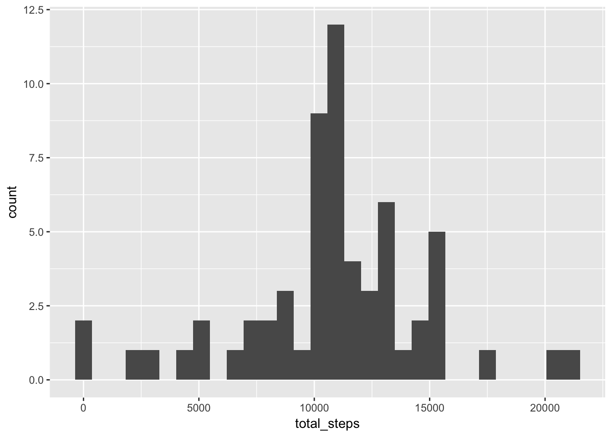
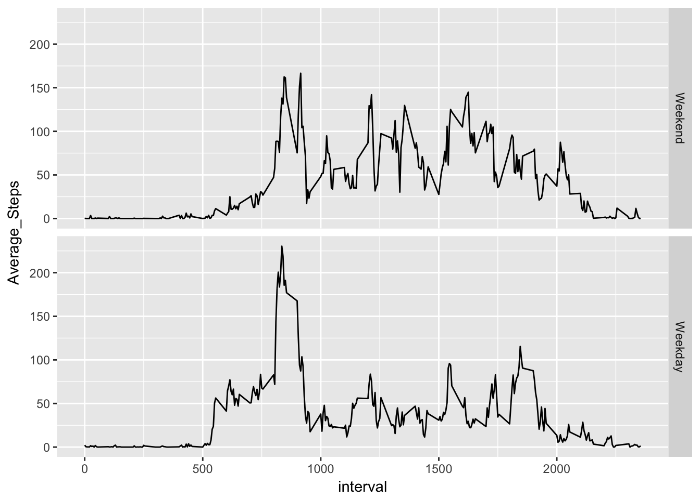

Title : "Reproducible Research: Peer Assessment 1"
===================
### Load the packages
```{r}
library(dplyr)
library(ggplot2)
```

## Loading and preprocessing the data
```{r}
activity<-read.csv("activity.csv",1)
```
## What is mean total number of steps taken per day?
* Data processing : 
```{r}
activity_totalsteps<-activity%>%group_by(date)%>%summarise(total_steps=sum(steps,na.rm=T))%>%filter(total_steps!=0)
```

* Plot histogram of total steps each day : 
```{r}
ggplot(activity_totalsteps,aes(x=total_steps))+geom_histogram()
```



* Calculate the mean of total steps each day :
```{r}
mean(activity_totalsteps$total_steps)
```

* Calculate the median of total steps each day :
```{r}
median(activity_totalsteps$total_steps)
```
## What is the average daily activity pattern?
* Data processing : 
```{r}
activity_daily<-activity%>%group_by(interval)%>%summarise(mean_steps=mean(steps,na.rm=T))
```

* Time series plot of the 5-minute interval (x-axis) and the averaged steps number taken
```{r}
ggplot(activity_daily,aes(x=interval,y=mean_steps))+geom_line()+ggtitle("Daily Activity Pattern")+theme(plot.title=element_text(size=18,hjust=0.5))
```


## Imputing missing values
* Calculate the number of missing data :
```{r}
sum(is.na(activity$steps))
```

* Write a function called impute.mean : 
```{r}
impute.mean<-function(x) replace(x,is.na(x),mean(x,na.rm=T))
```

* Replace the missing value with interval mean value :
```{r}
activity_imputed<-activity%>%group_by(interval)%>%mutate(steps=impute.mean(steps))
```

* Sum the dataset according to the date :
```{r}
activity_imputed_total<-activity_imputed%>%group_by(date)%>%summarise(total_steps=sum(steps))
```

* Create histogram for imputed dataset :
```{r}
ggplot(activity_imputed_total,aes(x=total_steps))+geom_histogram()
```


* Mean & Median
```{r}
mean(activity_imputed_total$total_steps)
median(activity_imputed_total$total_steps)
```
## Are there differences in activity patterns between weekdays and weekends?
* Label weekends and weekdays according to date.
```{r}
activity_imputed<-activity_imputed%>%mutate(weekday=as.Date(date))%>%mutate(weekday=weekdays(weekday))%>%mutate(weekday=factor(weekday%in%c("Saturday","Sunday"),levels=c(TRUE,FALSE),labels=c("Weekend","Weekday")))
activity_imputed2<-activity_imputed%>%group_by(interval,weekday)%>%summarise(Average_Steps=mean(steps))
```
* Plot the average steps correspond to intervals (x-axis).
```{r}
ggplot(activity_imputed2,aes(x=interval,y=Average_Steps))+geom_line()+facet_grid(weekday~.)
```

